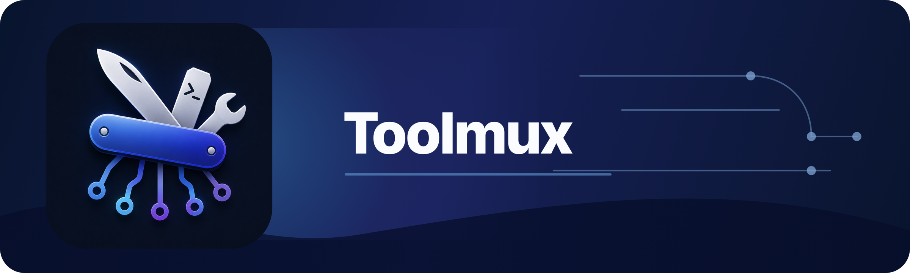
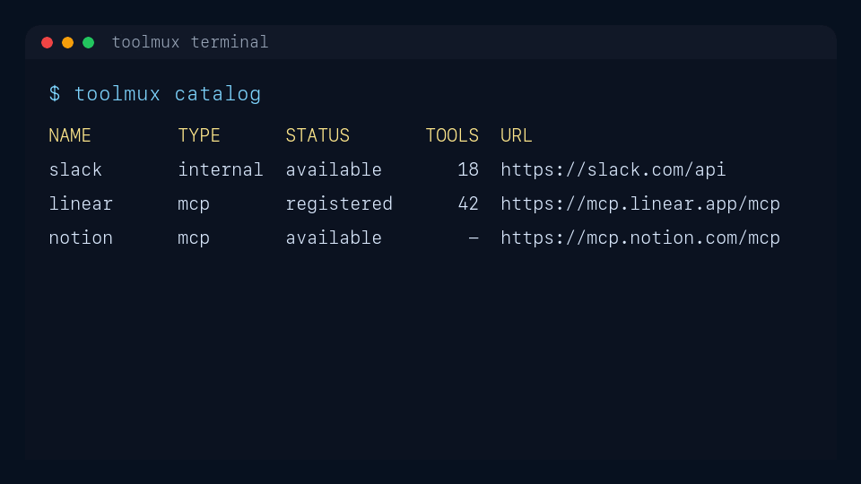

<p align="center">
  
</p>

# Toolmux

Toolmux connects services to your local agents and gives you the same tools as
a normal CLI. Add Slack, Google, or a remote MCP server once, configure your
agent once, then ask the agent to use those tools without copying tokens into
prompts.

Toolmux is built around four ideas:

1. One command surface for people, scripts, and agents.
2. Local credential custody through the operating system credential store.
3. Policy and `--read-only` checks before credentials are loaded.
4. Workflows that turn repeatable prompts into commands.

Toolmux is early software. Today it is most useful for Slack, Google Drive,
remote MCP toolboxes, and local agent setup for Codex, Claude Code, and Gemini
CLI.

## Supported Today

| Area | What is supported |
| --- | --- |
| Native toolboxes | Slack, Google Drive |
| Remote MCP catalog | Hosted Streamable HTTP MCP servers listed by `toolmux list --mcp` |
| Custom remote MCP | Any compatible Streamable HTTP MCP server URL |
| Agents | Codex, Claude Code, Gemini CLI |
| Workflow templates | `slack-recap` |

Use the CLI for the live list in your installed version:

```bash
toolmux --help
toolmux list
toolmux list --mcp
toolmux list --internal
toolmux workflow templates
```

`toolmux list` lists every built-in toolbox and includes a `Type` column so
you can distinguish remote MCP toolboxes from internal Toolmux toolboxes.
`toolmux ls` is a shortcut for the same command.
Remote MCP catalog entries are hosted endpoints that can be added and
authenticated through the server's own OAuth flow without creating your own
OAuth app first.
Built-in remote MCP entries currently include:

```text
airtable      asana        atlassian    cloudflare    datadog
excalidraw    figma        gainsight     github        grafana
granola       incident-io  linear        miro          neon
notion        pagerduty    pagerduty-eu  posthog       sentry
stripe        supabase     vercel        zoom          zoominfo
```

<p align="center">
  
</p>

## Install

With Homebrew:

```bash
brew install --cask fiam/tap/toolmux
toolmux version
```

Release archives for macOS, Linux, and Windows are available from
[GitHub Releases](https://github.com/fiam/toolmux/releases).

## Quick Start

Start by seeing what Toolmux can connect:

```bash
toolmux list
toolmux list --mcp
```

Add Slack when you are ready to connect a real workspace:

```bash
toolmux add slack --auth broker
toolmux status slack
```

Configure your local agent to see Toolmux tools over MCP:

```bash
toolmux mcp configure
```

With no agent argument, Toolmux detects installed supported agents and opens an
interactive selector. For scripts, name the agents explicitly:

```bash
toolmux mcp configure codex claude gemini
```

Now ask your agent to use Toolmux, for example:

```text
Use Slack through Toolmux to find the latest messages about the release plan.
```

Or run the built-in Slack recap workflow:

```bash
toolmux workflow init slack-recap --template slack-recap
toolmux workflow config set default-agent codex
toolmux workflow run slack-recap --input since=yesterday
```

If the Slack recap workflow has no `delivery_channel` input, it asks the agent
to send the recap to you by opening a Slack DM first and posting to that DM
channel.

## Slack

Slack is a native Toolmux toolbox under `toolmux slack`.
Native toolbox commands and MCP tools are shown only after that toolbox has
auth stored for the active Toolmux profile.

Common setup options:

```bash
# Hosted Toolmux broker. This is the simplest OAuth path.
toolmux add slack --auth broker

# Explicit token and cookie values from environment variables.
toolmux add slack --token-env SLACK_TOKEN --cookie-env SLACK_COOKIE

# Your own Slack OAuth app with a local loopback callback.
toolmux add slack \
  --auth oauth \
  --client-id "$SLACK_CLIENT_ID" \
  --client-secret-env SLACK_CLIENT_SECRET

# Explicit browser-session setup for a workspace subdomain.
toolmux add slack --workspace acme
```

`--workspace` is the Slack workspace subdomain, such as `acme` from
`https://acme.slack.com`. Browser-session setup only runs when you explicitly
request it with `--workspace` or `--from-browser`.

Useful Slack commands:

```bash
toolmux slack auth_test
toolmux slack channels_list --channel_types public_channel,private_channel
toolmux slack users_conversations --limit 20
toolmux slack experimental_conversations_list --query build
toolmux slack conversations_history --channel_id C123456 --limit 50
toolmux slack conversations_search_messages --search_query "from:@alice roadmap"
toolmux slack conversations_open --user_id U123456
toolmux slack conversations_add_message --channel_id C123456 --text "Build is green" --dry-run
toolmux slack conversations_add_message --channel_id C123456 --text "Build is green"
toolmux status slack
toolmux remove slack
```

Supported native Slack tool names:

- Auth: `auth_test`
- Channels and history: `channels_list`, `conversations_history`,
  `conversations_replies`, `conversations_search_messages`,
  `conversations_unreads`, `conversations_mark`, `users_conversations`,
  `experimental_conversations_list`
- Messages and DMs: `conversations_open`, `conversations_add_message`
- Files, reactions, users: `attachment_get_data`, `reactions_add`,
  `reactions_remove`, `users_search`
- User groups: `usergroups_list`, `usergroups_me`, `usergroups_create`,
  `usergroups_update`, `usergroups_users_update`

In Enterprise/Grid workspaces, Slack may restrict workspace-wide
`channels_list`. Try `users_conversations` to list conversations the
authenticated user is a member of; this documented Slack API method can still
be restricted by workspace policy. `experimental_conversations_list` is a
read-only Slack web-session fallback for browser-session auth and is explicitly
prefixed as experimental because it uses an undocumented Slack web app endpoint.

Run `toolmux slack --help` for the command list and per-tool flags.

## Google

Google is a native Toolmux toolbox focused on Google Drive.

Google uses brokered OAuth through `toolmuxd` and stores one local Google OAuth
bundle in the OS credential store. The default and only supported scope is the
non-sensitive `drive.file` scope, which lets Toolmux create files and access
files the user explicitly opens for the app.
Native Google commands and MCP tools are shown only after Google auth exists
for the active Toolmux profile.

```bash
toolmux google drive selected add
toolmux google drive selected list
toolmux google drive files copy 1abc... --name "Working copy"
toolmux google drive selected remove 1abc...

toolmux google drive pick
toolmux google drive available
toolmux google drive search --query "mimeType='application/vnd.google-apps.document'"
toolmux google drive get --file-id 1abc...
toolmux status google
```

For normal file access, start with `toolmux google drive selected add`. It opens
the brokered Google Picker flow, saves selected file IDs locally, and stores
the OAuth token. Run `toolmux add google` only when you want Drive API access
before selecting files.

Default scope:

```text
https://www.googleapis.com/auth/drive.file
```

With `drive.file`, Drive search is limited to files created by Toolmux or files
the user explicitly opened/shared with the Toolmux Google app. Drive-wide
discovery requires broader Drive scopes that Toolmux does not request.

`toolmux google drive selected add` and `toolmux google drive pick` create a
short-lived Picker session in `toolmuxd`, open Google Picker in the browser,
and poll the broker until Google returns selected file IDs.
`toolmux google drive selected add` saves the selected file IDs locally for later
reference, while `toolmux google drive pick` returns Picker output without
saving it. `toolmux google drive files copy` accepts a raw file ID or a
Docs/Drive URL and copies an accessible file into My Drive, defaulting the
destination parent to `root`. With `drive.file`, shared source files must be
selected through Picker before Toolmux can copy them. Removing a saved file
removes it from Toolmux's local list; users can revoke app grants from their
Google account when they need Google to forget that per-file app access.

Toolmux uses one Picker path: a short-lived brokered Google Picker session
through `toolmuxd`. The CLI does not expose a local Picker fallback or a Picker
API key.

## MCP Toolboxes

Toolmux can import MCP servers, cache their tool definitions, and expose them
in two places:

1. CLI commands under the registered toolbox name.
2. Proxied MCP tools from `toolmux mcp serve`.

Add from the built-in catalog:

```bash
toolmux list
toolmux add notion
toolmux mcp auth login notion
toolmux mcp sync notion
toolmux notion
```

Register a custom MCP endpoint:

```bash
toolmux add https://mcp.linear.app/mcp --name linear-work --no-sync
toolmux mcp auth login linear-work
toolmux mcp sync linear-work
toolmux linear-work
```

Register a command-backed MCP server over stdio:

```bash
toolmux add -- npx -y @upstash/context7-mcp
toolmux add -- docker run -i --rm browser-tools-mcp
```

Toolmux infers stdio MCP commands when the input is not a URL, built-in
catalog entry, or native toolbox. Use `--name` to override the derived command
namespace, and use `--stdio` only when the first command word would otherwise
match a built-in catalog entry or native toolbox. The `--` separator is needed
when command arguments use dash-prefixed flags, so those flags are passed to
the command instead of Toolmux.

The registered name becomes the CLI namespace. A server named `linear-work`
exposes commands as `toolmux linear-work <tool-name>` and MCP tools as
`linear-work.<tool-name>`.

For repeated non-secret arguments, configure defaults:

```bash
toolmux mcp defaults set atlassian cloudId <cloud-id>
toolmux mcp defaults ls atlassian
```

Show registered toolboxes and cached tools:

```bash
toolmux status
toolmux mcp ls
toolmux mcp ls -R
toolmux mcp show linear-work
```

Inspect schemas and call tools:

```bash
toolmux mcp ls linear-work
toolmux mcp schema linear-work <tool>
toolmux linear-work <tool> --json '{"key":"value"}'
```

Use `--json` for tool inputs that cannot be represented as flags.

## Agents

Toolmux serves MCP over stdio:

```bash
toolmux mcp serve
```

Most users should configure an agent instead of running `mcp serve` manually:

```bash
toolmux mcp configure
toolmux mcp configure codex
toolmux mcp configure claude --scope project
toolmux mcp configure gemini --scope user
```

Supported agent names:

| Agent | Names |
| --- | --- |
| Codex | `codex` |
| Claude Code | `claude`, `claude-code` |
| Gemini CLI | `gemini`, `gemini-cli` |

For non-interactive setup and teardown:

```bash
toolmux mcp enable codex claude
toolmux mcp disable gemini
```

Limit which tools an agent can see with MCP profiles:

```bash
toolmux mcp profile set readonly \
  --tool 'grafana.*' \
  --exclude-tool '*.send'

toolmux mcp profile default readonly
toolmux mcp configure codex --mcp-profile readonly --read-only
```

## Workflows

Workflows are YAML files that render a Go `text/template` prompt and run a
local agent command.

Global workflows live in:

```text
~/.toolmux/workflows
```

Project workflows live in:

```text
.toolmux/workflows
```

List templates and create a workflow:

```bash
toolmux workflow templates
toolmux workflow init slack-recap --template slack-recap
```

Template names are loaded from this repository on GitHub. You can also use a
GitHub template path or a direct YAML URL:

```bash
toolmux workflow init team-recap \
  --template github:acme/workflows/slack-recap.yaml@main

toolmux workflow init custom \
  --template https://example.com/workflow.yaml
```

Render a workflow before running it:

```bash
toolmux workflow render slack-recap --input since="yesterday 18:00"
```

Run with an explicit agent:

```bash
toolmux workflow run slack-recap \
  --agent "codex --yolo" \
  --input since="yesterday 18:00"
```

Set the default workflow agent:

```bash
toolmux workflow config set default-agent codex
```

In an interactive terminal, omit the value to select from detected agents:

```bash
toolmux workflow config set default-agent
```

Workflows can declare required toolboxes such as `internal:slack`,
`catalog:linear`, or a remote MCP URL. Missing requirements are added
automatically during `workflow init` and `workflow run` unless `--no-setup` is
passed.

If a workflow command or agent definition contains `{{ .prompt }}`, Toolmux
substitutes the rendered prompt there. Otherwise it appends the prompt as the
final argument.

## Output

Human output is the default. In an interactive terminal, Toolmux can use
tables, color, Markdown rendering, links, pagers, progress spinners, browser
opens, and selectors.

Use structured output for scripts and agents:

```bash
toolmux --output json mcp ls -R
toolmux --output yaml list
```

JSON and YAML output are stable and undecorated: no ANSI escapes, prompts,
spinners, pagers, or browser side effects.

Common global flags:

```text
--output table|json|yaml
--color auto|always|never
--pager auto|always|never
--profile <name>
--policy <path>
--read-only
--mcp-tool-call-timeout <duration>
```

MCP toolbox calls wait up to `60s` of response inactivity by default. Use
`--mcp-tool-call-timeout`, for example `--mcp-tool-call-timeout 2m`, when a
proxied MCP tool needs more time to return a `tools/call` response.

## Safety

Toolmux stores non-secret config in:

```text
~/.toolmux/config.yaml
```

Project config lives in:

```text
.toolmux/config.yaml
```

MCP server definitions and cached tool metadata are non-secret config.
Provider tokens, OAuth tokens, refresh tokens, bearer tokens, auth codes,
client secrets, and Slack token-cookie credentials are stored only in the OS
credential store or transient process memory.

Use `--read-only` to block commands with local or remote write effects before
credentials are read:

```bash
toolmux --read-only mcp ls -R
toolmux --read-only slack conversations_add_message \
  --channel_id C123456 \
  --text "This will be blocked"
```

Use local policy files for project guardrails:

```bash
toolmux policy init
toolmux policy catalog
toolmux policy check --command "mcp ls"
```

Policy discovery order:

1. `--policy <path>`
2. `TOOLMUX_POLICY=<path>`
3. `.toolmux/policy.yaml` in the current directory or a parent directory
4. No policy file, which allows local usage by default

Policy files are local guardrails for projects and automation. They are not a
security boundary against a user who controls the machine or working
directory.

## Self-Hosting

Toolmux uses the hosted OAuth broker at `https://api.toolmux.com` by default
for native provider flows that require confidential client secrets.

To self-host the broker, point the CLI at your own `toolmuxd`:

```bash
export TOOLMUX_TOOLMUXD_URL=https://auth.example.com
```

Google Drive uses the broker by default. For self-hosting, create a Google web
OAuth client, enable the Drive and Picker APIs, configure the Google variables
on `toolmuxd`, and point the CLI at that broker with `TOOLMUX_TOOLMUXD_URL`.

Self-hosting instructions are in [docs/SELF_HOSTING.md](docs/SELF_HOSTING.md).

## Help

```bash
toolmux --help
toolmux <toolbox> --help
toolmux mcp --help
toolmux workflow --help
toolmux doctor
```

For developer setup, tests, architecture notes, and release workflow, see
[CONTRIBUTING.md](CONTRIBUTING.md).
